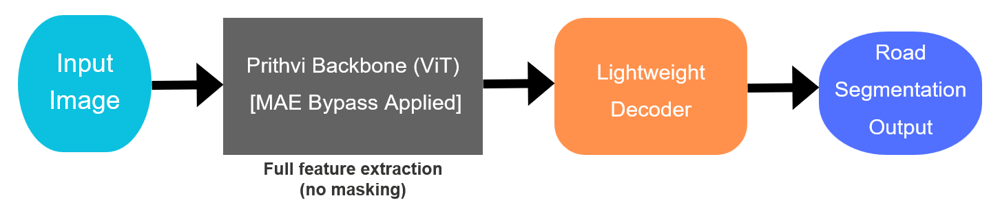
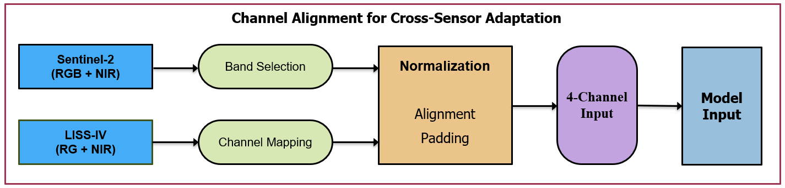
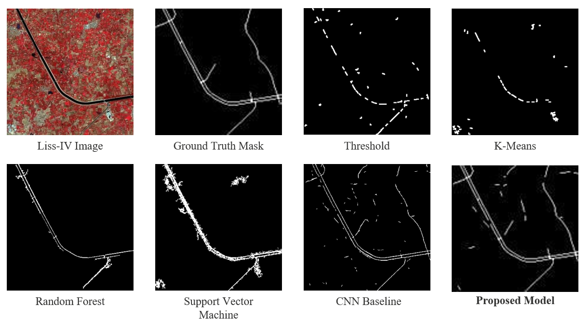

# **Topology-Preserving Road Extraction using Foundation Models**

<p align="center">
  <b>ISRO SAC Internship Project</b><br>
  Adapting Foundation Models for Geospatial Segmentation
</p>

<p align="center">
  
  
  
  
  
  
</p>

---

## Overview

This project presents a **topology-preserving road extraction pipeline** from satellite imagery using a modified foundation model.

Unlike standard segmentation approaches, the focus here is on **preserving connectivity** in extremely thin road structures (1–2 pixels wide), especially under **domain shift (Sentinel-2 → LISS-IV)**.

---

## Key Contributions

- MAE bypass to retain full spatial information  
- Lightweight decoder for dense segmentation  
- Hybrid loss (Focal + Dice) for imbalance + structure  
- Sliding window inference for large satellite images  
- Cross-sensor domain adaptation  

---

## Visual Overview

### Architecture


### Channel Alignment for Cross-Sensor Adaptation


---

## Results

### Quantitative Comparison

| Model            | Precision | Recall | F1 Score | IoU   |
|------------------|----------|--------|----------|--------|
| Threshold        | 0.0662   | 0.1136 | 0.0762   | 0.0399 |
| K-Means          | 0.0650   | 0.1317 | 0.0706   | 0.0369 |
| Random Forest    | 0.0520   | 0.4479 | 0.0901   | 0.0482 |
| SVM              | 0.0241   | 0.5746 | 0.0435   | 0.0226 |
| CNN Baseline     | 0.2130   | 0.7581 | 0.2130   | 0.1195 |
| **Proposed Model** | **0.2065** | **0.2695** | **0.2249** | **0.1268** |

---

## Qualitative Results



---

## Performance

- ~40 patches/sec (NVIDIA A100)
- Handles large images (~18k × 16k)
- Efficient sliding-window inference

---

## Project Structure

```
src/            → Core pipeline  
experiments/    → Classical + CNN baselines  
configs/        → Training configs  
results/        → Outputs  
assets/         → Diagrams  
docs/           → Report / PPT  
```

---

## Setup

```bash
pip install -r requirements.txt
```

---

## Run

### Training
```bash
python src/training/train.py
```

### Inference
```bash
python src/inference/infer.py \
  --input data/sample.tif \
  --checkpoint checkpoints/model.pth \
  --output results/pred.png
```

### Benchmark
```bash
python src/evaluation/benchmark.py
```

---

## Insights

- Thin roads → highly sensitive to pixel shifts  
- CNN improves recall but breaks connectivity  
- Foundation models capture global structure  
- MAE masking harms segmentation continuity  

---

## Future Work

- Multi-class segmentation  
- SAR + Optical fusion  
- Real-time deployment  
- Better occlusion handling  

---

## Author

[**Jayal Shah**]([https://www.linkedin.com/in/jayal-shah04/]())

B.Tech Computer Engineering (AI) 

---
